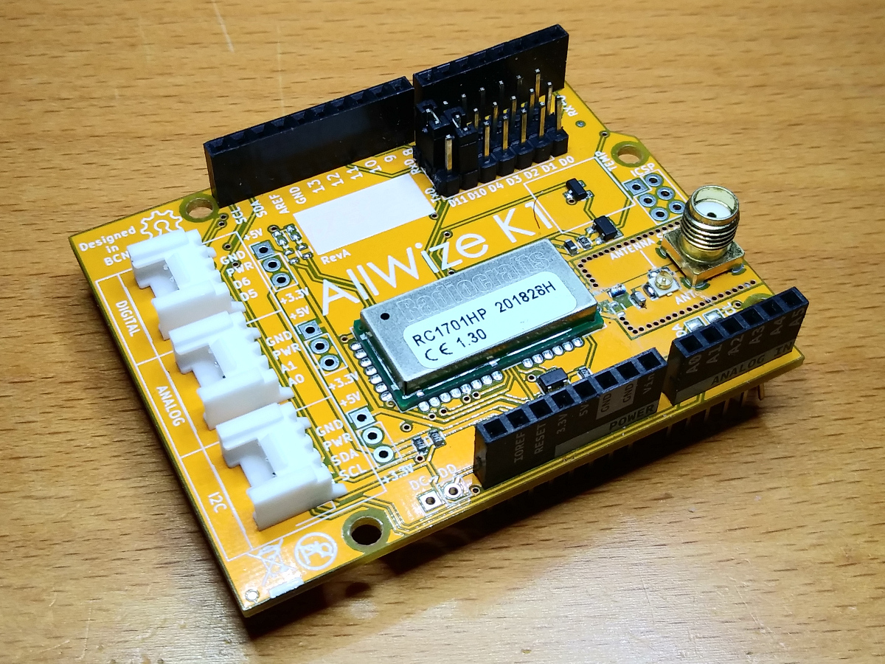

# AllWize K1

The Allwize K1 shield is an Arduino-compatible shield based on the RadioCrafts RC1701HP module. 

Resources:

* [AllWize K1 Wiki Page](http://wiki.allwize.io/index.php?title=Allwize_K1)
* [AllWize Library](https://github.com/AllWize/allwize) that supports the RC1701HP radio module.

